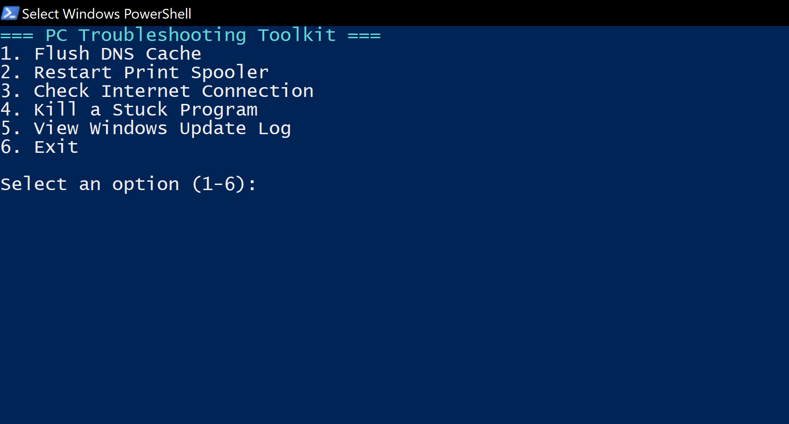

# 🧰 PC Troubleshooting Toolkit (PowerShell)

A compact, menu-driven PowerShell utility for Tier 1 IT Support Technicians to streamline common desktop troubleshooting tasks. Designed to run locally on Windows 10/11 machines with real-time logging and feedback.

## 🔧 Toolkit Features

| Option | Function                        |
|--------|---------------------------------|
| 1      | Flush DNS Cache                 |
| 2      | Restart Print Spooler           |
| 3      | Check Internet Connection (ping)|
| 4      | Force-close Stuck Programs      |
| 5      | View Windows Update Logs        |
| 6      | Exit with Timestamped Logging   |

All actions log to `toolkit.log` with timestamps and descriptive entries, aiding ticket documentation and post-support review.

## 🧾 Log File Sample (Windows Update)

Below is a captured `.log` output from the toolkit's Windows Update inspection utility. It highlights service shutdown sequencing and update status — useful for remote ticket validation and historical support review.


Key Insights:
- No pending updates detected
- Agent and COM API uninitialization processes logged
- Timestamped shutdown sequence enables reproducibility and pattern recognition


## 📂 File Overview

```
PC-Troubleshooting-Toolkit/
├── Toolkit.ps1           # Main script
├── toolkit.log           # Log file (created during execution)
└── README.md             # This documentation file
```

## 🚀 Usage Instructions

1. Open PowerShell as Administrator  
2. Navigate to the script directory  
3. Run the script:
```powershell
.\Toolkit.ps1
```
4. Use numeric keys to select troubleshooting options

## ✅ Requirements

- Windows 10 or Windows 11  
- PowerShell 5.x or higher  
- Internet access (for connectivity check)  
- Admin privileges (for spooler, update logs, and process control)

## ✍️ Author

**Shawn Sutton**  
🎯 Aspiring IT Support Specialist | CompTIA A+ (In Progress)  
📂 GitHub Portfolio
