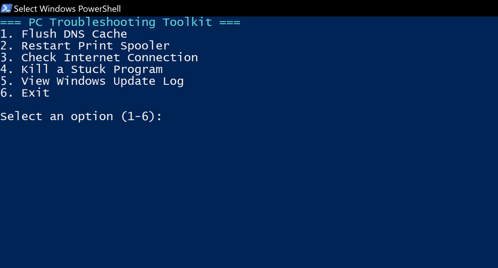
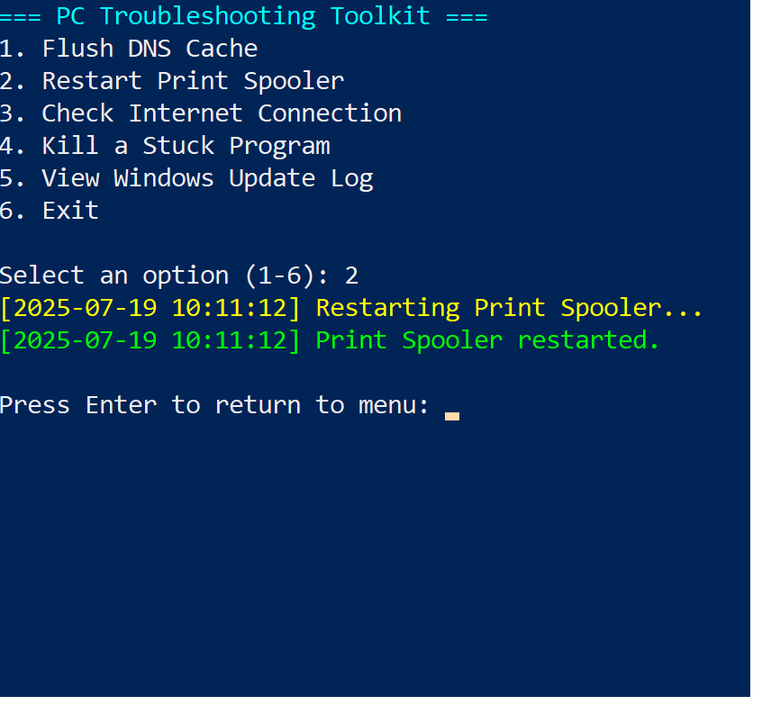
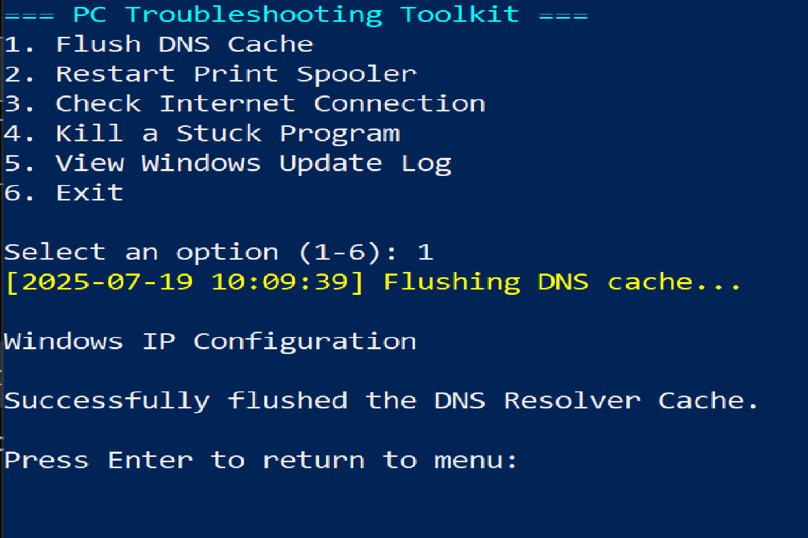
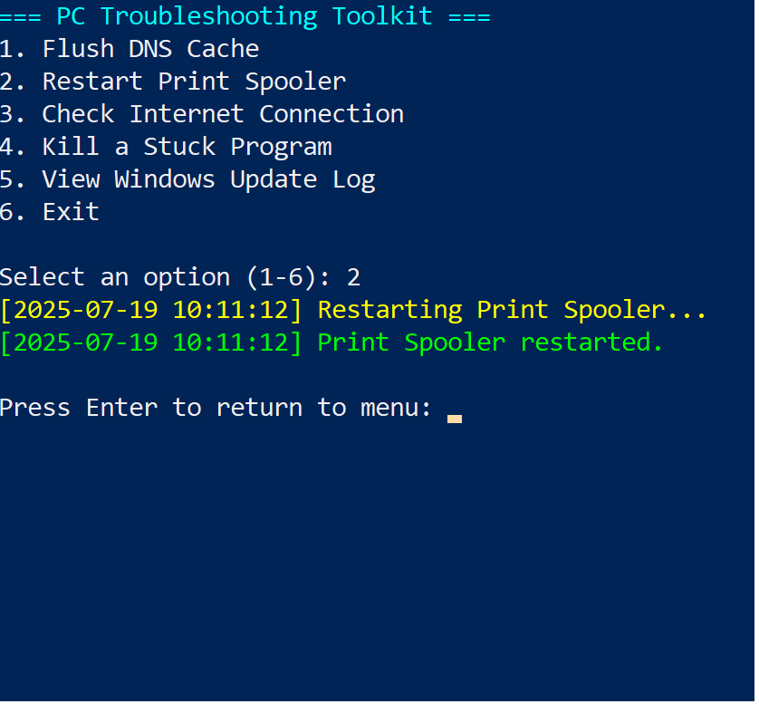
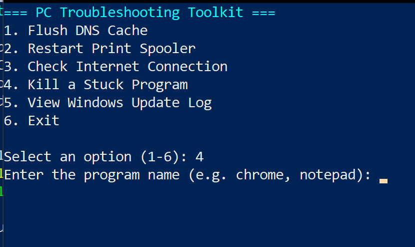
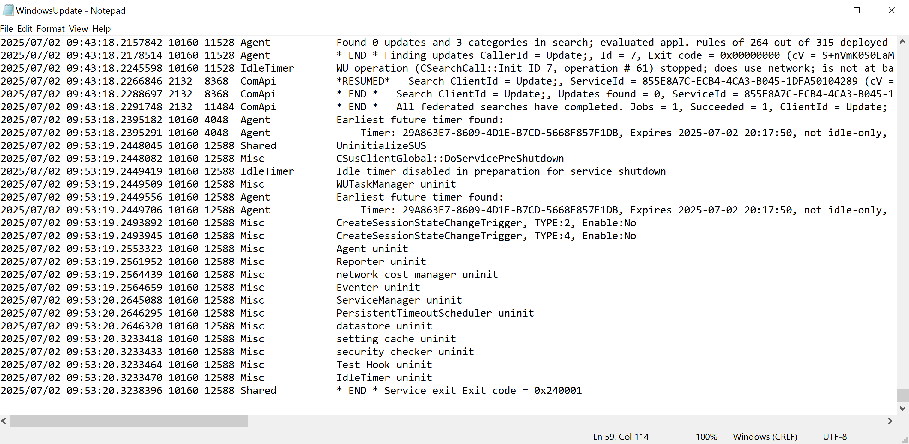

🧰 PC Troubleshooting Toolkit (PowerShell)
A compact, menu-driven PowerShell utility designed for Tier 1 IT Support Technicians to streamline common desktop troubleshooting tasks. Runs locally on Windows 10/11 and generates real-time logs to aid support documentation and ticket triage.

🔧 Toolkit Features & Visual Walkthrough
Each feature includes a live screenshot and outcome summary to showcase real execution and practical value.

🖼️ 1. Restart Print Spooler
markdown

Resolves printer job stuck issues by restarting the spooler service.

🌐 2. DNS Flush
markdown

Clears DNS cache to fix domain resolution problems.

📶 3. Internet Connectivity Check
markdown

Pings common addresses to test live internet status.

🛑 4. Kill Command
markdown

Forces app or service termination — useful in freeze scenarios.

🔄 5. Windows Update Log Access
markdown

Displays recent Windows Update activity for troubleshooting.

🧾 Log File Sample
Here’s a sample .log entry from Option 5 (Windows Update):

Highlights:

No pending updates found

Clean shutdown of update agents

Timestamped entries for ticket validation and audit trail

📁PC-Troubleshooting-Toolkit/
├── Toolkit.ps1           # Main script
├── toolkit.log           # Execution log output
├── assets/               # Screenshots and banner images
└── README.md             # This file

🚀 How to Use
Open PowerShell as Administrator

Navigate to the script directory

Run the toolkit:

powershell
.\Toolkit.ps1
Choose actions with number keys and view results inline + in toolkit.log

✅ Requirements
Windows 10/11

PowerShell 5.x or newer

Admin rights for spooler and update access

Internet connection (for connectivity check)

✍️ Author
Shawn C. Sutton 📍 Remote IT Support Candidate | CourseCareers IT Track (In Progress) | CompTIA A+ (Studying for 2026) 🔗 GitHub Portfolio
